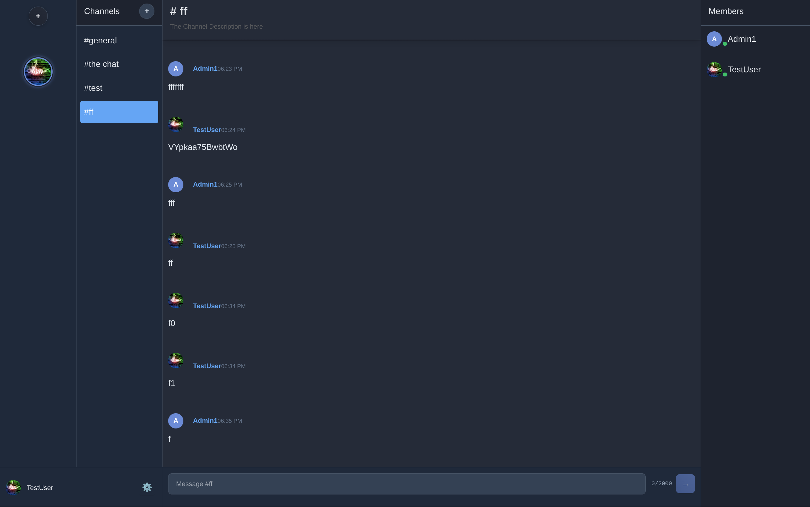
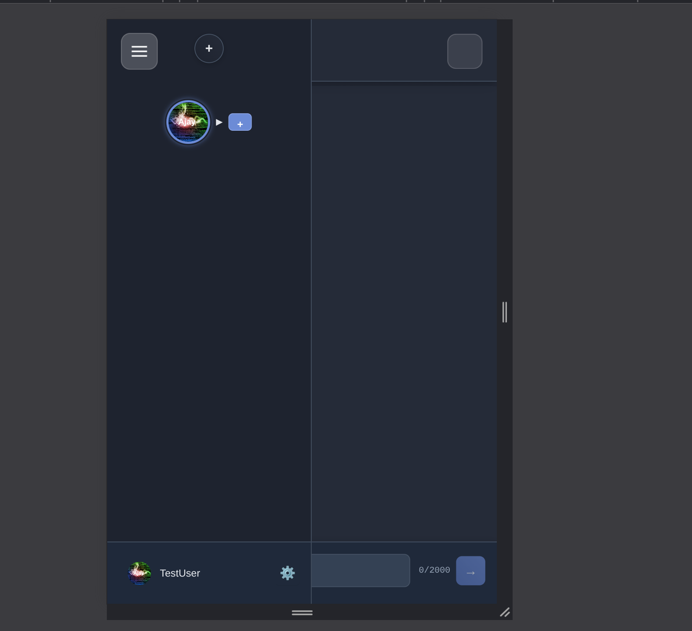

# Nexus

**Nexus** is a privacy-focused, real-time chat platform built for performance and scalability.

Currently in development, Nexus includes:

- Guild and channel creation
- Real-time messaging (WebSocket-based)
- Custom profile pictures and presence
- Admin dashboard for managing bans, webhooks, and users
- Settings pages for guilds, channels, and users
- User Bios
- Modular frontend (vanilla JS + Tailwind)
- Backend in Go using Echo, with Redis and PostgreSQL

---

## Screenshots

### Desktop

### Mobile

---

## Stack

- **Backend**: Go (Echo)
- **Frontend**: Vanilla JavaScript + Tailwind CSS
- **Database**: PostgreSQL
- **Cache / Presence**: Redis
- **Real-time**: WebSockets

---

## Status

This project is under active development.  
No license is applied yet.  
Contributions and self-hosting instructions will be available at a later stage.
